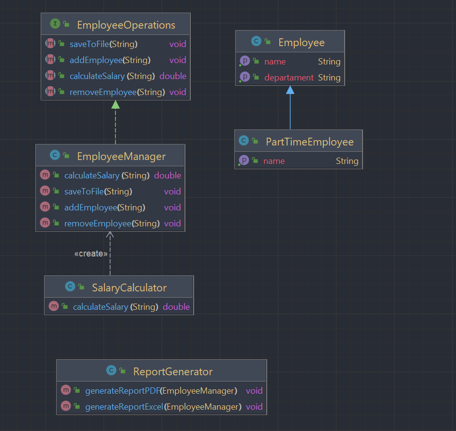

# INTEGRANTES

### Bryam Diaz
### Jose Guzman
### Juan Abril


# Principios SOLID en el Proyecto

## Violaciones a los Principios SOLID



*Este es el diagrama de clases sin modificaciones, es para lograr explicar un poco mejor lo que está a continuación.*


### Responsabilidad Única (Single Responsibility Principle - SRP)
- **ReportGenerator** tiene dos responsabilidades: generar reportes en Excel y en PDF.
    - Se debe dejar por separado en clases distintas.
      ```java
      public class ReportGenerator {
          public void generateReportExcel(EmployeeManager employeeManager) {
              // Generar reporte
          }
  
          public void generateReportPDF(EmployeeManager employeeManager) {
              // Generar reporte
          }
      }
      ```
  - **SalaryCalculator** está calculando el salario y gestionando empleados.
    ```java
    public double calculateSalary(String name) {
        EmployeeManager employeeManager = new EmployeeManager();
        return employeeManager.calculateSalary(name);
    }
    ```
- **EmployeeManager** tiene más de una responsabilidad: gestión de empleados y cálculo de salarios.
    - Los métodos no aportan al sentido único de la clase, la cual es manejar los empleados:
      ```java
      public class EmployeeManager implements EmployeeOperations {
          public void addEmployee(String name) {
              // Agregar empleado
          }
  
          public void removeEmployee(String name) {
              // Eliminar empleado
          }
  
          public double calculateSalary(String name) {
              // Calcular salario
              return 0.0;
          }
  
          public void saveToFile(String name) {
              // Guardar en archivo
          }
      }
      ```

### Abierto/Cerrado (Open/Closed Principle - OCP)
- **EmployeeManager** no está diseñada para ser extendida sin modificar el código existente.
      

### Principio de Sustitución de Liskov (Liskov Substitution Principle - LSP)
- **PartTimeEmployee** viola este principio porque el método `getName` genera una excepción, no manteniendo el comportamiento esperado de la clase base `Employee`.
  ```java
  public class PartTimeEmployee extends Employee {
      @Override
      public String getName() {
          throw new UnsupportedOperationException();//acá!!!
      }
  }
  ```

### Segregación de Interfaces (Interface Segregation Principle - ISP)
- La interfaz **EmployeeOperations** tiene métodos que no son relevantes para todas las clases que la implementan.
    - Ejemplo:
      ```java
      public interface EmployeeOperations {
          void addEmployee(String name);
          void removeEmployee(String name);
          double calculateSalary(String name);//no tiene nada que ver
          void saveToFile(String name); //no tiene nada que ver
      }
      ```

### Inversión de Dependencias (Dependency Inversion Principle - DIP)
- **SalaryCalculator** depende directamente de la clase concreta **EmployeeManager** en lugar de una abstracción.
  ```java
  public double calculateSalary(String name) {
      EmployeeManager employeeManager = new EmployeeManager();
      return employeeManager.calculateSalary(name);
  }
  ```
- **ReportGenerator** es una clase de bajo nivel que debería conectarse con las clases de alto nivel a través de una interfaz y debería tener clases separadas para generar reportes en PDF y Excel.
    - Ejemplo:
      ```java
      public class ReportGenerator {
          public void generateReportExcel(EmployeeManager employeeManager) {
              // Generar reporte
          }
  
          public void generateReportPDF(EmployeeManager employeeManager) {
              // Generar reporte
          }
      }
      ```
      ***Nota:** No consideramos ningún probelama con inyección de dependencias, porque en ReportGenerator ya lo cumple, incluso intenta recibir el objeto como parametro.*
